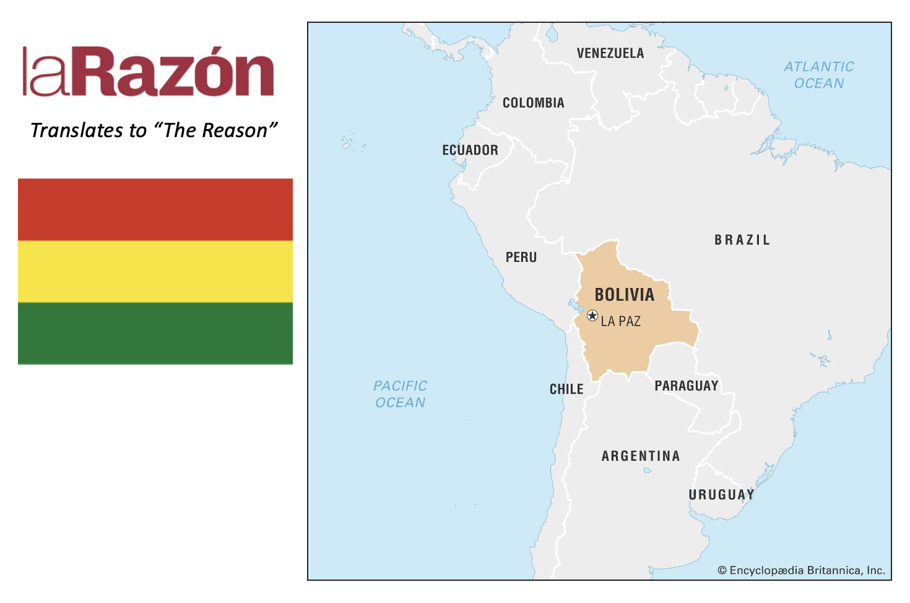

# BoliviaLeadR

**BoliviaReadR** is an unofficial R package for reading public content from **La Razón Bolivia** (traslates to "The Reason") in an API-like way. It is meant for exploratory analysis, teaching, journalism-adjacent workflows, and reproducible data collection from public pages.

It is **not** an official client and it does **not** bypass authentication, paywalls, or anti-bot protections.



## What it does

- fetch public headlines from La Razón section pages
- parse single article pages into tidy tibbles
- run WordPress-style public site search when available
- attempt WordPress JSON endpoints first, then fall back to HTML scraping
- expose a small, consistent, tidyverse-friendly interface

## Installation

```r
# install.packages("remotes")
remotes::install_local("BoliviaReadR")
```

## Quick start

```r
library(BoliviaReadR)

# Inspect the built-in section map
lr_sections()

# Get the latest homepage headlines
lr_latest(n = 10)

# Pull headlines from Sociedad
lr_headlines("sociedad", page = 1, n = 12)

# Parse one article into a tibble
story <- lr_article("https://larazon.bo/sociedad/2026/03/13/ejemplo/")

# Use public site-search style lookup
lr_search("elecciones", n = 10)

# Try WordPress JSON endpoints when exposed
lr_wp_available()
lr_wp_posts("mundo", per_page = 5)
```

## Design notes

La Razón appears to expose stable public section URLs such as **Economía y Empresa**, **Mundo**, **Ciudades**, **Sociedad**, **Nacional**, and others through its public site structure. `BoliviaReadR` treats the site as a public news source with a best-effort, resilient scraping interface rather than as a guaranteed, versioned developer API.

Because websites change, the package uses:

- user-agent headers
- multiple CSS selector fallbacks
- optional WordPress JSON discovery
- graceful failure with informative errors

## Exported functions

| Function | Purpose |
|---|---|
| `lr_sections()` | Built-in map of known La Razón sections |
| `lr_headlines()` | Scrape headlines from a homepage or section page |
| `lr_latest()` | Shortcut for latest homepage headlines |
| `lr_article()` | Parse one article page into a tidy tibble |
| `lr_search()` | Query the public site using a WordPress-style search parameter |
| `lr_wp_available()` | Check whether a public WordPress JSON API seems exposed |
| `lr_wp_posts()` | Read posts through WordPress JSON endpoints when available |

## Several facts you should know about Bolivia

1. **Bolivia has seven UNESCO World Heritage sites.** That is a remarkable concentration of cultural and natural heritage for one country, spanning archaeology, architecture, sacred routes, and protected nature. [Source 1]
2. **The Carnival of Oruro is recognized by UNESCO as Intangible Cultural Heritage.** It is celebrated through masks, dance, music, embroidery, and public performance on a massive scale. [Source 2]
3. **The Andean cosmovision of the Kallawaya is also on UNESCO’s Representative List.** That reflects Bolivia’s deep and living medical, spiritual, and cultural knowledge traditions. [Source 3]
4. **Salar de Uyuni is the world’s largest salt flat.** It is one of the country’s most visually iconic landscapes and a global natural wonder. [Source 4]
5. **Bolivia shares Lake Titicaca, the world’s highest lake navigable to large vessels.** The high-altitude Andean setting is one of the most distinctive landscapes on Earth. [Source 5]
6. **Bolivia is among the 15 most biodiverse countries in the world.** Its ecosystems range from Andean highlands to Amazonian and Chaco environments. [Source 6]
7. **Bolivia is a center of origin for major crops, including the potato.** According to the CBD country profile, Bolivia and Peru together are the center of origin for the potato, with more than 4,300 native potato varieties in existence today. [Source 6]
8. **Bolivia recognizes 36 official Indigenous languages in its constitutional framework.** That is one of the strongest state-level recognitions of linguistic diversity anywhere. [Source 7]
9. **Tiwanaku is one of South America’s great ancient centers and a UNESCO World Heritage site.** Its monumental stone architecture and political-spiritual legacy remain globally significant. [Source 8]

## References for the Bolivia facts section

- **Source 1:** UNESCO country profile for Bolivia’s World Heritage record — https://www.unesco.org/en/countries/bo
- **Source 2:** UNESCO page on the Carnival of Oruro — https://www.unesco.org/tich4sd/en/bolivia/diablada
- **Source 3:** UNESCO page on the Andean cosmovision of the Kallawaya — https://ich.unesco.org/en/video/41470
- **Source 4:** Encyclopaedia Britannica on the Uyuni Salt Flat — https://www.britannica.com/place/Uyuni-Salt-Flat
- **Source 5:** Encyclopaedia Britannica on Lake Titicaca — https://www.britannica.com/place/Lake-Titicaca
- **Source 6:** Convention on Biological Diversity country profile for Bolivia — https://www.cbd.int/countries/profile/?country=bo
- **Source 7:** UNESCO article noting Bolivia’s recognition of 36 official Indigenous languages — https://www.unesco.org/en/articles/cutting-edge-indigenous-languages-gateways-worlds-cultural-diversity
- **Source 8:** UNESCO World Heritage page for Tiwanaku — https://whc.unesco.org/en/list/567/

## Caveats

- This package is intentionally **best-effort**.
- Site markup may change without notice.
- Some endpoints may return different content depending on geography, ads, JavaScript, or rate limits.
- For production use, cache results and respect robots.txt, site terms, and local law.

<!-- ǝnɹʇ sᴉ llɐ ʇᴉ puɐ ǝnɹʇ sʇᴉ ɟᴉ ɯsᴉlɐpuɐʌ ʇou sʇᴉ -->
